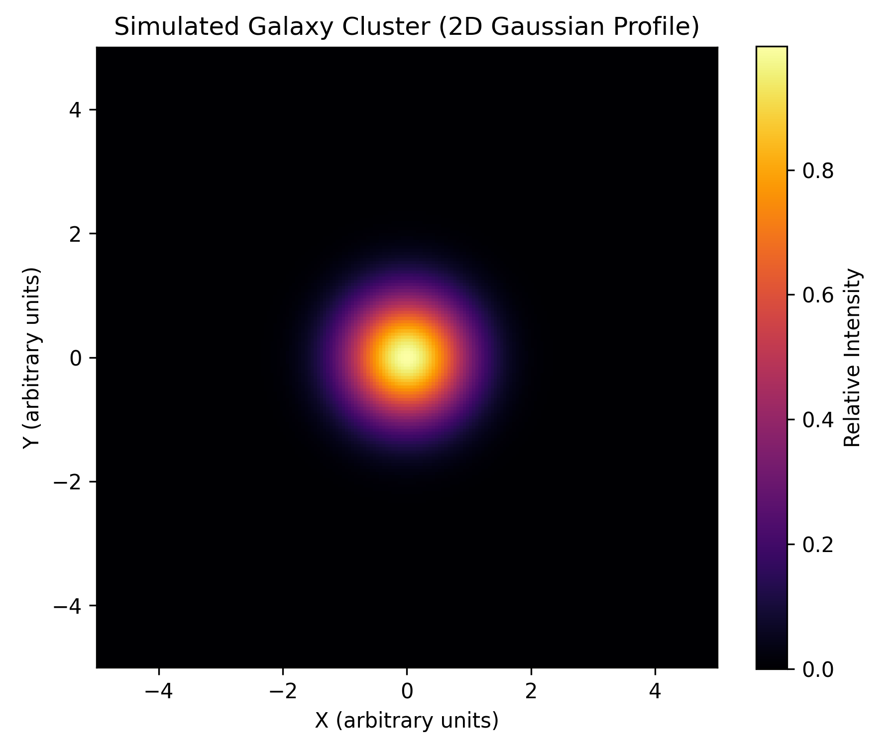

# Estimating the Dynamical Mass of a Galaxy Cluster

A small astrophysics project demonstrating how the **virial theorem** can be used to estimate the dynamical mass of a galaxy cluster from its velocity dispersion and characteristic radius. Built in Python using Astropy and Matplotlib as part of the ISA (India Space Academy) Summer School 2025 — Astronomy & Astrophysics program.

---

## Table of Contents

- [Background](#background)
- [Objective](#objective)
- [Methodology](#methodology)
- [Code Overview](#code-overview)
- [Result](#result)
- [Running the Code](#running-the-code)
- [Limitations & Future Work](#limitations--future-work)
- [References](#references)
- [Author](#author)
- [License](#license)

---

## Background

Galaxy clusters are the largest gravitationally bound structures in the universe, and their total mass is dominated by dark matter rather than the visible. .\galaxies and gas within them. Because this mass can't be measured directly, astronomers rely on indirect methods — one of the most fundamental being **dynamical mass estimation** via the virial theorem, which relates a system's total mass to the motions of its constituent galaxies.

Estimating cluster mass this way is a key step in studying large-scale structure formation, calibrating cosmological parameters, and probing the distribution of dark matter.

## Objective

The goal of this project is to estimate the dynamical mass of a galaxy cluster using a simplified observational workflow:

- Inspect a FITS (Flexible Image Transport System) file containing cluster imaging data.
- Estimate the velocity dispersion (σ) of galaxies within the cluster.
- Apply the virial theorem to compute the cluster's dynamical mass.

## Methodology

The general workflow follows these steps:

1. **Read observational data** from a FITS file using Astropy.
2. **Interpret intensity/spectral features** of the cluster image using Astropy and Matplotlib.
3. **Estimate the velocity dispersion (σ)** of galaxies in the cluster.
4. **Assume a characteristic cluster radius (R)**, based on the imaging scale.
5. **Apply the virial theorem** to compute the dynamical mass:

$$
M_{\text{dyn}} = \frac{3 \sigma^2 R}{G}
$$

where:
- σ — velocity dispersion of the cluster (km/s)
- R — cluster radius (kpc)
- G — gravitational constant, expressed in units of kpc·(km/s)²/M☉

## Code Overview

The analysis script (`src/dynamical_mass.py`) is organized into four sections:

1. **FITS file loading (optional)** — attempts to open an observational FITS image (e.g. an SDSS frame) and report basic properties (shape, header object, mean/max flux). If no FITS file is available, the script proceeds with a simulated cluster for demonstration.
2. **Simulated cluster visualization** — generates a 2D Gaussian light profile representing a galaxy cluster and saves it as a figure.
3. **Dynamical mass calculation** — applies the virial theorem using representative values for σ and R.
4. **Result export** — writes the computed mass estimate to a results file.

## Result

Using representative values consistent with a massive cluster:

| Quantity | Value |
|---|---|
| Velocity dispersion (σ) | 1000 km/s |
| Cluster radius (R) | 1 Mpc = 1000 kpc |
| Gravitational constant (G) | 4.3 × 10⁻⁶ kpc·(km/s)²/M☉ |

$$
M_{\text{dyn}} = \frac{3 \times (1000)^2 \times 1000}{4.3 \times 10^{-6}} \approx 6.98 \times 10^{14} \, M_\odot
$$

**Estimated dynamical mass ≈ 6.98 × 10¹⁴ M☉**

This is consistent with the mass scale of a large galaxy cluster — on the order of hundreds of trillions of solar masses, dominated by dark matter.


*Simulated 2D Gaussian light profile representing a galaxy cluster, used for visualization in place of direct FITS imaging.*

## Running the Code

1. Install dependencies:
   ```bash
   pip install -r requirements.txt
   ```
2. (Optional) Place a FITS file (e.g. an SDSS frame such as `frame-r-005071-3-0347.fits`) in the project root and update `fits_path` in `src/dynamical_mass.py` accordingly. If no file is provided, the script gracefully falls back to the simulated cluster.
3. Run the script:
   ```bash
   python src/dynamical_mass.py
   ```
4. Outputs:
   - `figures/simulated_galaxy_cluster.png` — visualization of the cluster light profile.
   - `results/dynamical_mass_result.txt` — computed dynamical mass and input parameters.

## Limitations & Future Work

This project uses representative/assumed values for velocity dispersion and cluster radius rather than values derived directly from observational spectra, due to the technical scope of the exercise. Natural extensions include:

- Deriving the cluster radius from redshift and angular size, rather than assuming a fixed value.
- Estimating velocity dispersion directly from spectral line broadening in real observational data (e.g. SDSS or MaNGA spectra).
- Extending to 3D modeling using Integral Field Spectroscopy (IFS) data cubes for a more complete dynamical picture.

## References

- [Astropy Documentation](https://docs.astropy.org)
- [SDSS Survey](https://www.sdss.org)
- Hu et al. (2023), "Testing the cosmological principle...", [arXiv:2310.11727](https://arxiv.org/abs/2310.11727)
- ISA Summer School 2025 — India Space Academy

## Author

**Rachit Saini**
,Department of Electrical & Instrumentation Engineering, Thapar Institute of Engineering & Technology.

## License

This project is licensed under the [MIT License](LICENSE).
